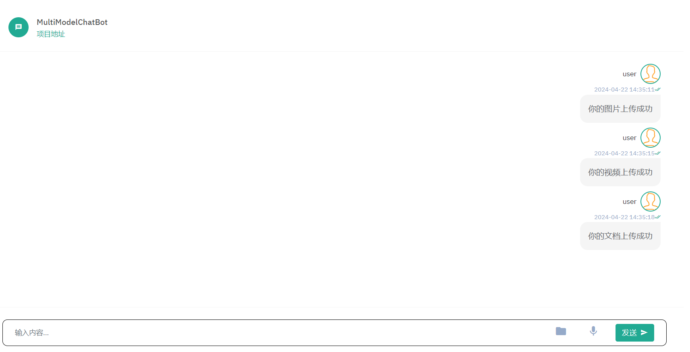
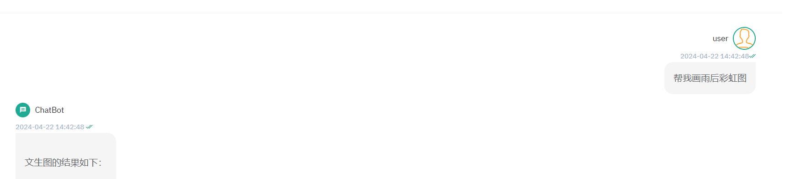
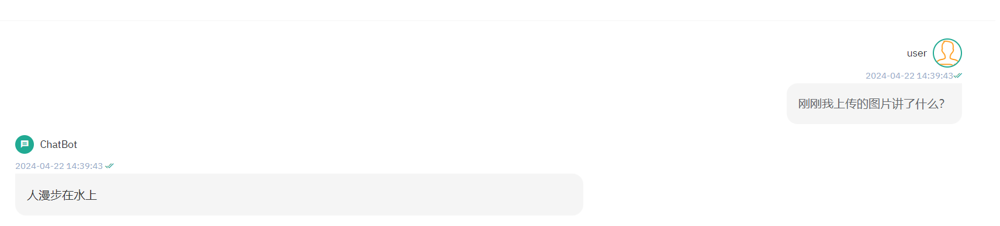
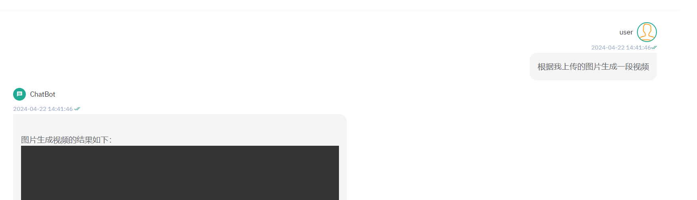
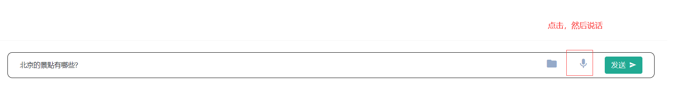
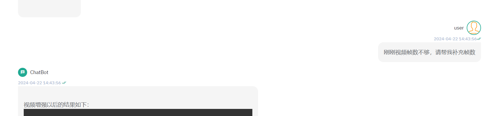

# 多模态聊天机器人

一行prompt可联动LLM、文生图、图升文、文生视频、图生视频、视频增强，还结合了语音能力。

本项目中所用的模型都是开源的：

| 模型类别   | 模型名称         | 所属公司/学校 | github地址                                                   | 显存需求      |
| ---------- | ---------------- | ------------- | ------------------------------------------------------------ | ------------- |
| LLM        | ChatGLM2-6b      | 清华          | https://github.com/THUDM/ChatGLM2-6B                         |               |
| 文生图     | stable-diffusion | Stability AI  | https://github.com/AUTOMATIC1111/stable-diffusion-webui      |               |
| 图生文     | VisualGLM-6B     | 清华          | https://github.com/THUDM/VisualGLM-6B                        | 14G           |
| 图生视频   | Image2Video      | 阿里          | https://www.modelscope.cn/models/iic/Image-to-Video          |               |
| 视频增强   | Video-to-Video   | 阿里          | https://modelscope.cn/models/iic/Video-to-Video/             |               |
| 语音转文字 | whisper          | openai        | https://github.com/openai/whisper                            | large-v3(16G) |
| 文字转语音 | speech_sambert   | 阿里          | https://www.modelscope.cn/models/iic/speech_sambert-hifigan_tts_zh-cn_16k |               |

LLM采用openai风格的接口，如果没有openai风格的接口，请自行适配。

项目的前端来自开源项目：https://gitee.com/hoppin/chatgpt-front，作者在上面进行了简化。

## 效果展示

### LLM

默认是sse实现的流式接口，非流式接口可用post请求调用 /chatCompletion，body结构如下：

```json
{
	"messages":[
		{"role":"system","content":"你是一个聊天机器人"},
		{"role":"user","content":"你是谁？"}
	],
	temperature:0.1,
	top_k : 1,
	stream: false,
	max_tokens: 1024,
	model_name:  "gpt-3.5-turbo"
}
```

### 意图识别

目前使用大模型利用few-shot进行意图识别的，请求如下：

```json
{
	"messages":[
		{"role":"system","content":"请根据用户的输入判断，和文生图相关则返回 text2image，和图生文相关则返回 image2text，和图生视频相关则返回 image2video，和视频增强相关则返回 videoenhance，其他的则返回 llm，以下是例子：\n\n生成雨后彩虹图 –>  text2image \n 这个图片讲的什么？  –>  image2text  \n用这个图片来生成视频   –>  image2video  \n增强这个视频的帧数   –> videoenhance  \n北京的景点有哪些   –> llm"},
		{"role":"user","content":"帮我生成齐白石的虾"}
	]
}
```


### 文件上传

目前支持文档、图片和视频的上传。

文档：大模型根据文档回答

图片： 图生文、图生视频

视频： 视频增强



### 文生图




### 图生文




### 图生视频



### 语音识别



### 视频增强




因为有些模型无法api访问，作者整理了几个整个api的接口，在[文件夹](./script)


# to do list

| 序号 | 更新内容                                                     | 更新说明                                                     |
| ---- | ------------------------------------------------------------ | ------------------------------------------------------------ |
| 1    | 更换前端的框架，将sse的请求换成post，从而来支持多messages的访问 | 目前eventsource只支持get请求，使用fetch-event-source可以支持post请求，因此需要把前端框架换成vue |
| 2    | 更准确的意图识别                                             | 现在的意图识别是直接调用大模型的，效果还行，但是很消耗token，以后看能不能换成通过embedding来进行意图识别 |
| 3    | 支持多文档的聊天                                             | 通过向量数据库中保存文件，进而可以让prompt和不同的文件进行匹配。 |
| 4    | 文档中的图片也可以在聊天的时候返回                           | 通过转换图片中的文字，进而转换文档中的内容。                 |
| 5    | 选择更好的多模态大模型                                       | 现在的很多多模态大模型效果都比较一般                         |

